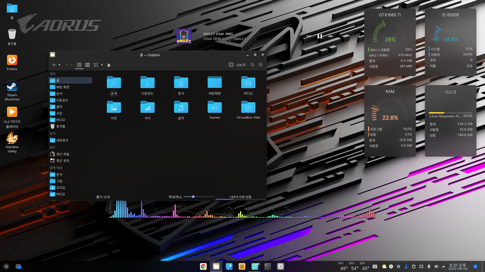
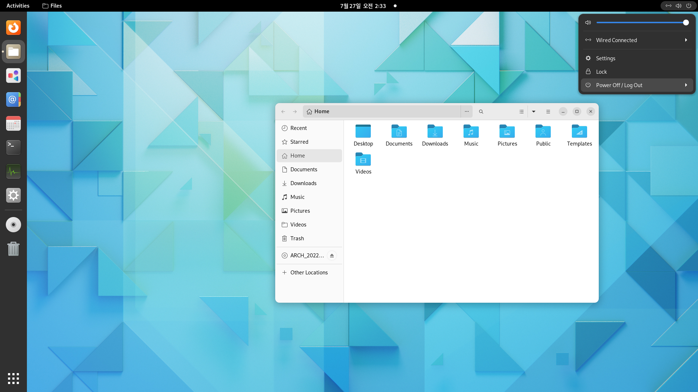

# Quantum-icon-theme
Linux icon theme

# Based On
* Papirus (some assets)
* Fluent by vinceliuice
* Moka by snwh (Design)
* breeze-extended-alt (Trash Can Design)

# Features

* Pixel Perfect Icons (16px/24px/32px/48px/64px/128px/256px)
* Pop!_OS COSMIC Support
* Elegant Folder Icons
* Weather icons for GNOME and KDE

# Install(Not recommended now)

Open terminal, and run install.sh file.

# Contributing

Go to Template folder.

# Screenshot

*  KDE Plasma

*  GNOME

